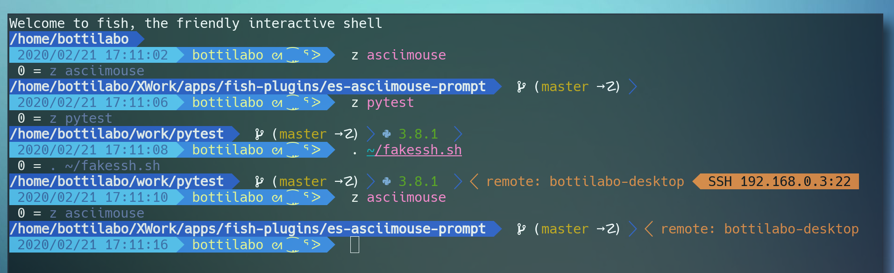

### es-asciimouse-prompt
> Powerline style kawaii ASCIImouse prompt for fish shell.



# ASCIImouse
- ASCIImouse is created by ROM子 (twitter @riv_mk)
- https://twitter.com/asciimouse 

# Requirements
- fish shell, above version 3.0
- Nerd fonts https://www.nerdfonts.com/

# Install

## fisher
```
fisher add bottilabo/es-asciimouse-prompt
```

## fundle
add below code to .config/fish/config.fish
```
if not functions -q fundle; eval (curl -sfL https://git.io/fundle-install); end

fundle plugin 'bottilabo/es-asciimouse-prompt'
fundle init
```

## manual install
just copy files inner functions dir into ~/.config/fish/functions/

# License, Copyright, Information etc..
- made by Bottilabo (twitter @bottilabo)
- es-asciimouse-prompt is based on [es theme](https://github.com/oh-my-fish/theme-es)
- [MIT License](LICENSE) 
